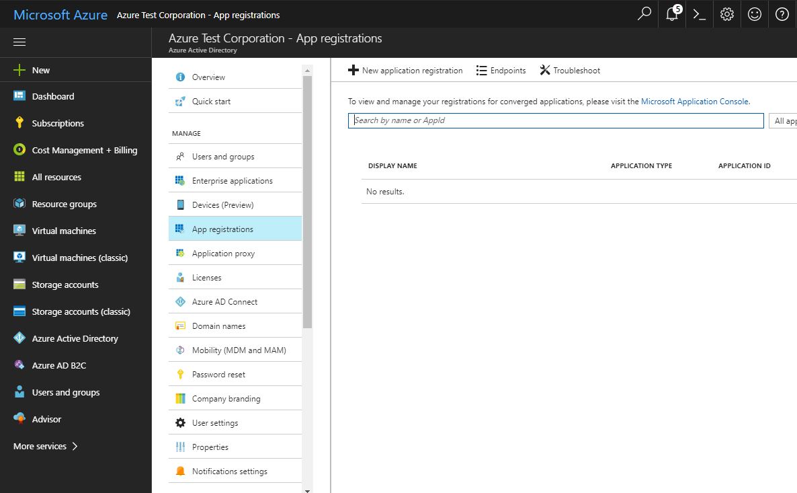
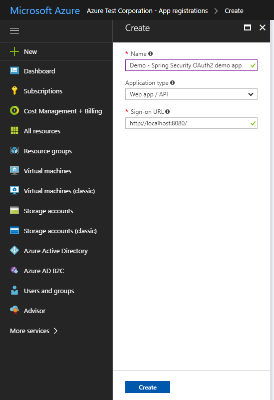
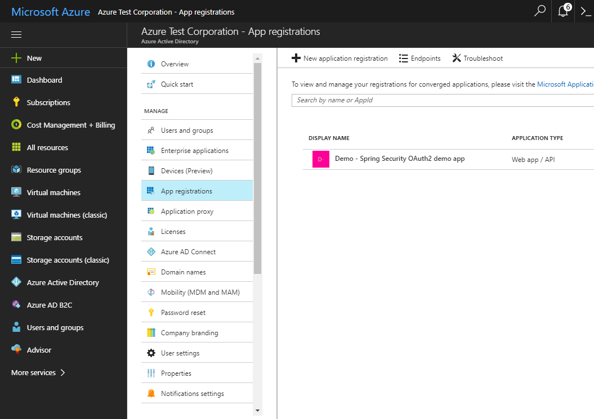
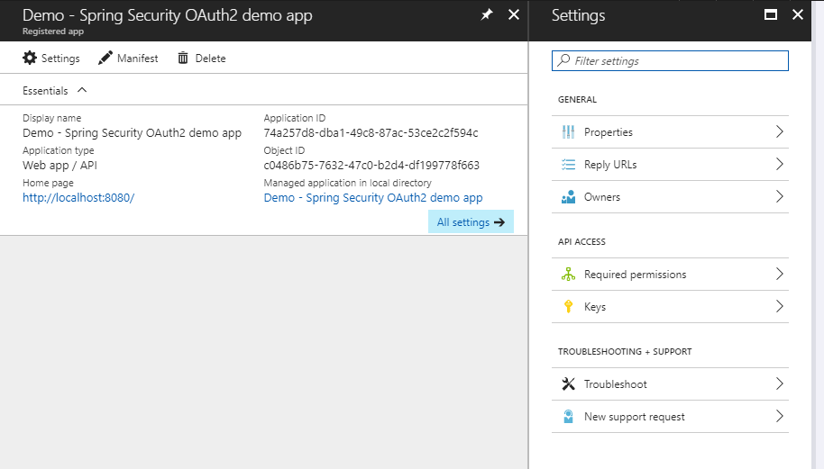
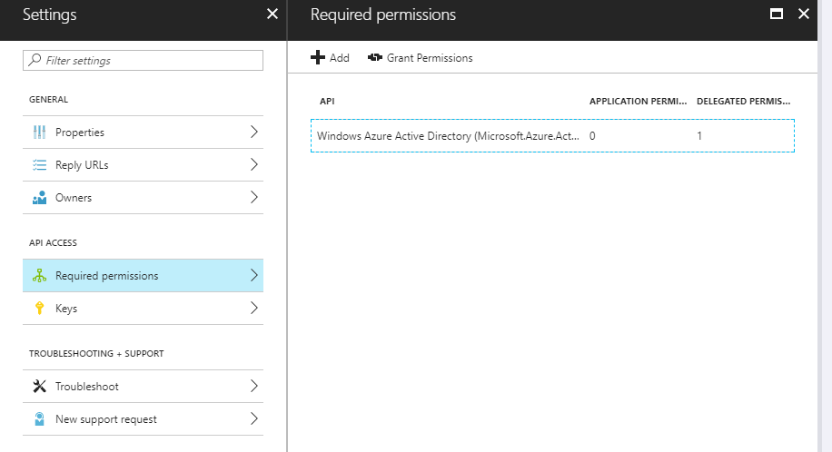
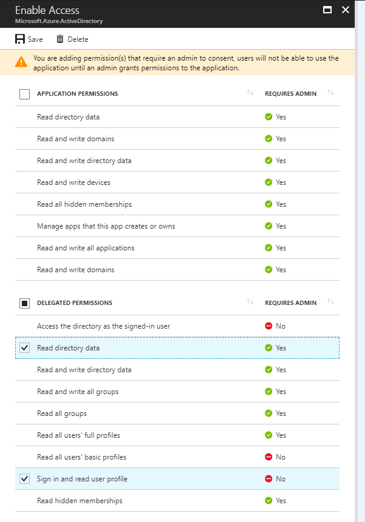
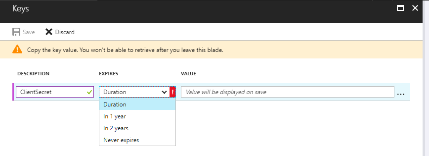
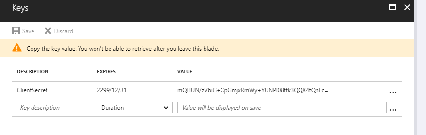

# Java Spring Boot Azure AD OIDC-OAuth2 sample application

This application is a sample of Azure AD integrated Spring Boot application.

# How to use this sample application

## Preparation

1. Install all dependency libraries
    ```command
    mvn install
    ```

2. Create Azure AD application
    1. Open Azure Active Directory tenant via Azure portal.
    2. Click "New application registration" via *Application registrations* menu.
    
        
    
    3. Create new "Web app/API" type application as below, and set **http://localhost:8080/** as Sign-on URL.

        

    4. Open new created application.

        

    5. Copy **Application ID** of new application (using it later).

        

    6. Add **http://localhost:8080/login** to Reply URLs.

        

    7. Configure application permissions in *Required permissions* menu - Check **Read directory data** in *Delegated Permissions*, and save it.
    
        
        
        

    8. Create new **client secret key** in *Keys* menu - Copy key value after clicking "Save" icon (using it later).
    
        
        

3. Modify src/main/resources/application.yaml
  - Replace \<client id\> with **Application ID** of Azure AD Registered app
  - Replace \<client secret\> with **client secret key** value of Azure AD Registered app
  - Replace \<tenant domain\> with your Azure Active Directory domain

    ```command
    security:
      oauth2:
        client:
          clientId: <client id>
          clientSecret: <client secret>
          accessTokenUri: https://login.microsoftonline.com/<tenant domain>/oauth2/token
          userAuthorizationUri: https://login.microsoftonline.com/<tenant domain>/oauth2/authorize
    ```

## Building this sample application

1. Delete 'target' folder.

2. Build sample application with maven.

    ```command
    mvn clean package
    ```

## Running this sample application

1. This is a Spring Boot application, there is a *.jar file in the 'target' folder after building sample application. You can use Java runtime to run application with the executable jar file.

    ```command
    java -jar .\target\spring-boot-oauth2-azuread-sample-0.0.1-SNAPSHOT.jar
    ```
